# docintel — Architecture & Data Flow Reference

This document is the single source of understanding for the entire docintel system.
Every diagram maps directly to production code in `src/`. Each section explains
**what** the component does, **why** it is designed that way, **what is critical**
to get right, and **what happens when things fail**.

---

## Color Legend

All diagrams share a consistent color scheme:

| Color | Meaning |
|---|---|
| Dark blue `#1A5276` | Input data, entry points, raw material |
| Orange/amber `#B7770D` | Processing logic, decisions, transformations |
| Forest green `#1D6A4A` | Output data, successful results, storage writes |
| Purple `#5B2C6F` | Database storage, configuration, metadata |
| Dark teal `#154360` | Retrieval interfaces, query results |
| Dark olive `#6E2F1A` | Infrastructure (queue, bridges, manifests) |
| Crimson `#922B21` | Failure paths, error states, flagged items |

---

## Table of Contents

1. [Full System Architecture](#1-full-system-architecture)
2. [Smart Router Decision Logic](#2-smart-router-decision-logic)
3. [Layout Detection Pipeline](#3-layout-detection-pipeline)
4. [Data Model Relationships](#4-data-model-relationships)
5. [VLM Extraction + Validator Correction Loop](#5-vlm-extraction--validator-correction-loop)
6. [Chunker — Region Grouping Logic](#6-chunker--region-grouping-logic)
7. [Multi-Database Write with Manifest](#7-multi-database-write-with-manifest)
8. [Storage Adapter Internals](#8-storage-adapter-internals)
9. [Neo4j Knowledge Graph Structure](#9-neo4j-knowledge-graph-structure)
10. [Fused Retrieval — Reciprocal Rank Fusion](#10-fused-retrieval--reciprocal-rank-fusion)
11. [Celery Queue Flow](#11-celery-queue-flow)
12. [Schema Versioning — Read Adaptation](#12-schema-versioning--read-adaptation)
13. [Observability Instrumentation Points](#13-observability-instrumentation-points)
14. [Page Break Bridging Detail](#14-page-break-bridging-detail)
15. [Table Extraction Data Flow](#15-table-extraction-data-flow)
16. [Module Dependency Map](#16-module-dependency-map)

---

## 1. Full System Architecture

**What this shows:** The complete pipeline from raw document submission to structured storage and fused retrieval across all four databases. Every box is a module in `src/`.

**Why this architecture:** Traditional document pipelines use OCR as a first step and accept character-level errors that propagate through everything downstream. This system instead uses a VLM (DeepSeek-OCR-2) as the extraction engine — it reads the document as an image and produces structured output directly. However, VLMs do not produce bounding boxes, so a separate layout detector (DocLayout-YOLO) runs first to locate every element on the page. Only then are individual crops sent to the VLM. This two-stage design gives us both spatial precision (from YOLO) and semantic understanding (from the VLM).

**Critical flow:** The path `Format Ingestor → Preprocessor → DocLayout-YOLO → XY-cut → Cropper` must complete before any VLM call. These stages run sequentially per document but are CPU-bound and fast (< 200ms/page). VLM extraction then runs as a bounded async pool — up to `VLM_CONCURRENCY_LIMIT=8` parallel calls, one per chunk.

**Failure handling:** If a VLM call fails all retries, the chunk is stored with `confidence_score=0.0` and `review_required=True`. The pipeline does **not** stop — all other chunks complete and the document is written to all databases. The failed chunk is retrievable and queryable; it just needs human review.

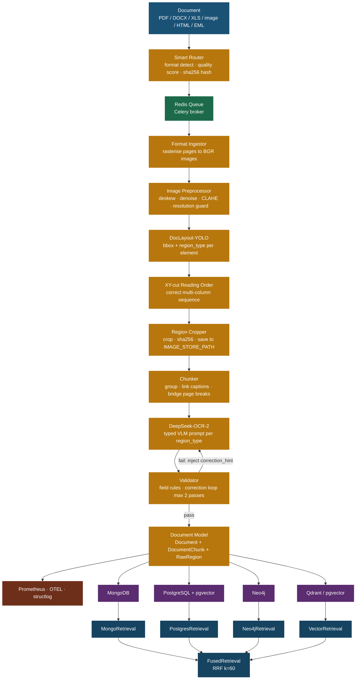

**Component glossary:**

| Component | File | Role |
|---|---|---|
| Smart Router | `src/router.py` | Single entry point — classifies format, assigns quality tier, computes dedup hash |
| Redis Queue | `docker-compose.yml` service | Decouples submission from processing; enables horizontal scaling |
| Format Ingestor | `src/ingestion/*.py` | Converts any document format to a list of BGR page images |
| Image Preprocessor | `src/layout/preprocessor.py` | Fixes scan quality before any model sees the image |
| DocLayout-YOLO | `src/layout/detector.py` | Provides bounding boxes — without this step, there are no crop coordinates |
| XY-cut Reading Order | `src/layout/reading_order.py` | Fixes column interleaving — critical for two-column academic papers |
| Region Cropper | `src/layout/cropper.py` | Saves every element as a PNG file; the path is stored in every database |
| Chunker | `src/extraction/chunker.py` | Groups regions; decides what gets its own chunk vs what gets merged |
| DeepSeek-OCR-2 | `src/extraction/vlm_client.py` | The extraction brain — reads crops and returns structured JSON |
| Validator | `src/extraction/validator.py` | The safety net — catches malformed VLM output before it reaches storage |

---

## 2. Smart Router Decision Logic

**What this shows:** How `src/router.py` selects the correct ingestor and assigns a quality tier before any page processing begins.

**Why this matters:** The router runs synchronously and completes in milliseconds. It is the only component that reads the source file before the Celery task picks it up. Its two key outputs are:
- `content_hash` — the sha256 dedup key checked against all databases before any VLM spend
- `quality_tier` — controls rasterisation DPI (`standard=300`, `high_detail=400`) and VLM prompt verbosity

**Critical decision — PDF quality detection:** For PDFs, PyMuPDF extracts text from the first 5 pages and computes a text density ratio (characters / page area). A ratio below `0.3` means the PDF is likely scanned (images with no embedded text). These get `quality_tier=high_detail`, which triggers higher DPI rasterisation and a more detailed VLM prompt template. Mixed PDFs (some scanned, some digital) are flagged per-page internally by the ingestion stage.

**Failure mode:** If the file extension is unrecognised and MIME sniffing also fails, the router silently falls back to `TextIngestor`. This is intentional — it ensures the pipeline never hard-fails at the routing stage, but the operator should monitor `router_decision` log entries for unexpected fallbacks.

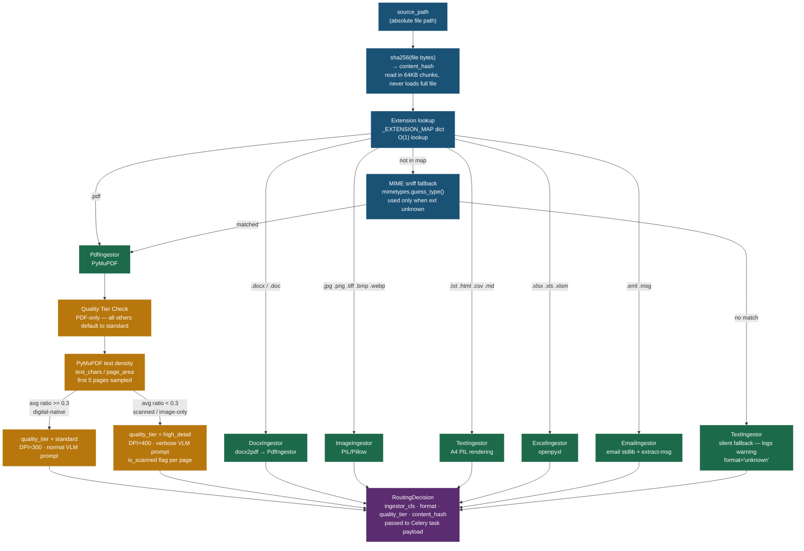

**Configuration hooks:**

| ENV variable | Effect |
|---|---|
| `LAYOUT_CONF_THRESHOLD` | Minimum YOLO confidence for a region to be kept (not a router setting, but related) |
| Quality tier threshold `0.3` | Hardcoded in `router.py:_HIGH_DETAIL_DENSITY_THRESHOLD` — change to tune scanned detection sensitivity |
| `LAYOUT_INPUT_SIZE` | Passed to YOLO — higher values detect smaller text but increase inference time |

---

## 3. Layout Detection Pipeline

**What this shows:** The four-step transformation from a raw rasterised page image to a list of `RawRegion` objects, each with a bounding box, a region type, and a saved crop file.

**Why we need layout detection at all:** DeepSeek-OCR-2 is an end-to-end VLM — it does not output pixel coordinates. If you send a full page to it, you get text back, but you cannot crop individual figures out as files, you cannot separate table structures from body text, and you cannot detect that there are three separate images on one page. DocLayout-YOLO solves this: it runs a fast single forward pass over the page image and returns one bounding box per detected element type.

**Critical step — Reading Order (XY-cut):** DocLayout-YOLO detects regions but does not determine reading order. Simply sorting by `(y0, x0)` breaks on any two-column document — regions from column 2 will interleave with column 1. The XY-cut algorithm fixes this by recursively splitting the page at its largest whitespace gaps, then sorting within each resulting zone. The output `region_index` reflects true reading order.

**Critical step — Preprocessor:** This runs before YOLO and before any VLM call. Deskewing is essential — a 2° rotation causes YOLO to misclassify regions and the VLM to misread text. The bilateral filter preserves text stroke edges while removing noise. CLAHE restores legibility of fax-quality documents. These four steps add < 5ms/page.

**Failure mode:** If the YOLO model weights file is missing (`configs/doclayout_yolo.pt` not found), `detector.py` logs a warning and returns a single full-page TEXT region covering the entire image. The pipeline continues — the VLM receives the full page as one region. Extraction quality degrades but the document is not lost.

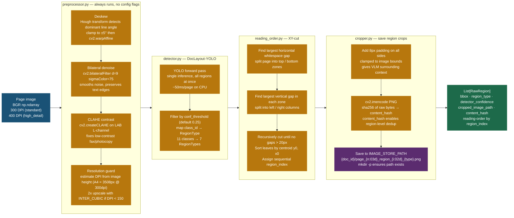

**DocLayout-YOLO class mapping:**

| YOLO class_id | Label | Maps to RegionType |
|---|---|---|
| 0 | text_block | TEXT |
| 1 | title | TEXT (title content, chunker handles heading detection) |
| 2 | list | TEXT |
| 3 | table | TABLE |
| 4 | figure | FIGURE |
| 5 | figure_caption | CAPTION |
| 6 | table_caption | CAPTION |
| 7 | header | HEADER |
| 8 | footer | FOOTER |
| 9 | reference | TEXT |
| 10 | equation | FORMULA |

---

## 4. Data Model Relationships

**What this shows:** How all Pydantic models in `src/models.py` relate to each other and what each field is for.

**Why `schema_version` on every model:** The data model will evolve. `schema_version=2` is the current version. When a new field is added (version 3), all databases still hold records at version 2. The `_adapt_chunk()` method in `src/storage/base.py` transparently upgrades v2 records to v3 on read, without requiring a database migration of all rows. See Diagram 12 for the full upgrade logic.

**Why `overview` is always required on `DocumentChunk`:** It is the fallback when everything else fails. If OCR produces garbage (`raw_text` is empty), if the table parser fails (`table_data` is None), if the VLM returns a low-confidence response — `overview` always contains at least a 1-2 sentence VLM description of what the chunk image shows. This means every chunk is searchable via vector similarity, regardless of OCR quality.

**Why `content_hash` on both `Document` and `RawRegion`:** Document-level hash deduplicates entire re-submitted files. Region-level hash detects identical crops across different documents (e.g. a company logo appearing on every page of a large corpus) and can be used to skip redundant VLM calls in future optimisations.

**Critical field — `reading_order_index`:** This is a global sequential counter across all pages of a document. It is what the Neo4j `NEXT_CHUNK` chain is sorted by. When you traverse the graph `(:Chunk)-[:NEXT_CHUNK*]->(:Chunk)`, you are reading the document in correct reading order.

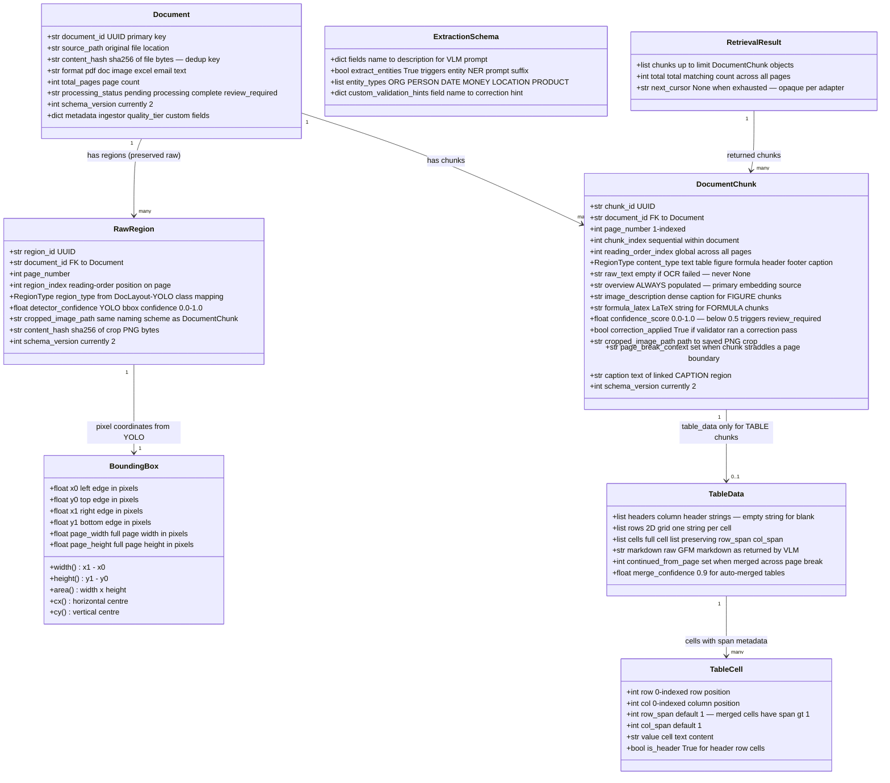

---

## 5. VLM Extraction + Validator Correction Loop

**What this shows:** The per-chunk extraction flow — from selecting the right prompt template through to a validated, storage-ready response. This is the most compute-intensive part of the pipeline.

**Why typed prompts per region:** A TABLE prompt instructs the VLM to produce structured JSON with `headers`, `rows`, and `cells`. A FIGURE prompt asks for a dense visual description and any embedded text. Sending the same generic prompt for all region types produces much worse results — a general prompt applied to a table tends to produce a prose description of the table rather than structured data. The seven prompt templates in `configs/vlm.yaml` are the primary lever for improving extraction quality without changing code.

**The correction loop — why it matters:** VLMs hallucinate and produce malformed JSON. Without the correction loop, a TABLE response with mismatched column counts (a very common failure) would be stored as-is, making the `TableData` unusable for queries. The validator catches this, constructs a targeted re-prompt that includes the specific failure reason (`"Each row must have the same number of columns as the headers"`), and resends the cropped image with the corrected prompt. In practice ~15% of TABLE regions require at least one correction pass.

**Cost control:** The correction loop is capped at 2 passes (`VLM_CORRECTION_MAX_PASSES`). After 2 failures, the chunk is stored with `confidence_score=0.0` and flagged. The pipeline never blocks indefinitely on a single broken region. CORRECTIONS Prometheus counter tracks how often each region type triggers corrections — if table corrections spike, the TABLE prompt template needs refinement.

**Critical failure — VLM timeout:** If the VLM endpoint is unreachable, `httpx` retries with exponential backoff (1s, 2s, 4s up to `VLM_MAX_RETRIES`). After all retries fail, the chunk receives a fallback response `{raw_text: "", overview: "", confidence: 0.0}`. The pipeline records this and continues. No chunk ever blocks the entire document.

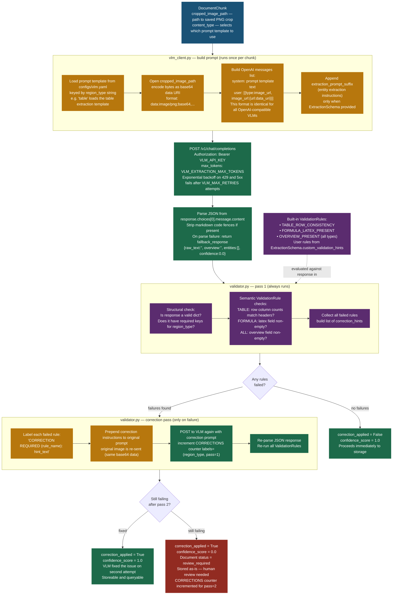

**Prompt template structure in `configs/vlm.yaml`:**

Each region type has a `system` prompt (detailed extraction instructions, output JSON schema) and an `overview_instruction` (appended to every call regardless of extraction schema). The `extraction_prompt_suffix` with entity extraction is appended only when an `ExtractionSchema` is provided by the caller.

**Tuning guide:** If a specific region type produces frequent corrections, edit the corresponding prompt in `configs/vlm.yaml`. No code change required. Restart the celery worker after edits — the YAML is loaded at `VLMClient` initialisation, not per-call.

---

## 6. Chunker — Region Grouping Logic

**What this shows:** How `src/extraction/chunker.py` converts a list of `RawRegion` objects (one per detected element) into a shorter list of `DocumentChunk` objects that will each become one VLM call.

**Why grouping:** If DocLayout-YOLO detects 40 text regions on a page (paragraph blocks), sending 40 separate VLM calls would be wasteful. Adjacent TEXT regions are merged into a single chunk up to `max_text_chars=1500`. Each TABLE, FIGURE, and FORMULA always gets its own chunk — these must never be merged with text because they need type-specific extraction prompts and their own `table_data` or `image_description` fields.

**Why captions are attached, not standalone:** A CAPTION region contains metadata about an adjacent FIGURE or TABLE. Storing it as a separate chunk with no link to its figure would make retrieval meaningless. The chunker walks backward through the current page's chunks to find the nearest FIGURE or TABLE ancestor and attaches the caption text to `chunk.caption`. Captions do not generate their own VLM call — they are plain text.

**Why HEADER/FOOTER get metadata_only=True:** Headers and footers (page numbers, document titles, running heads) are noise for most extraction use cases. They are collected but tagged with `metadata["metadata_only"] = True` in `pipeline.py`, causing them to be skipped in the VLM extraction loop. They are still stored in the database for completeness.

**Page break bridging — why it is important:** When a sentence spans two pages (e.g., a contract clause that starts on page 3 and ends on page 4), the last chunk on page 3 and the first chunk on page 4 are stored as separate objects. Without bridging, a vector search for the full clause would only surface one of them. The `page_break_context` field on each chunk encodes the overlap — both chunks are findable.

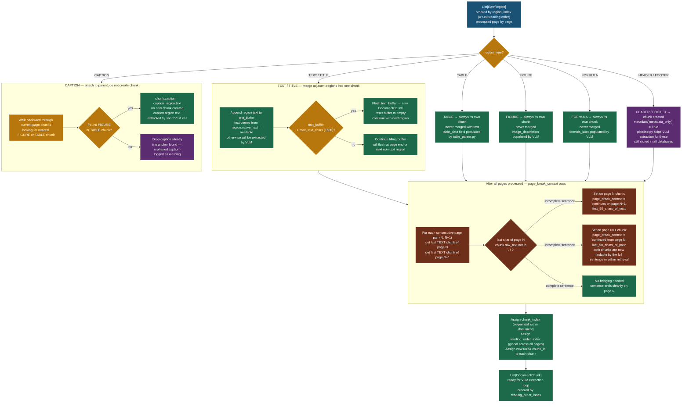

---

## 7. Multi-Database Write with Manifest

**What this shows:** How the pipeline writes one `Document` to multiple adapters simultaneously, tracks per-adapter success/failure in a manifest file, and enables surgical retry of only the failed adapters.

**Why a manifest file:** If MongoDB write succeeds but Neo4j write fails (e.g. Neo4j is restarting), the document exists in MongoDB but not in Neo4j. Without a manifest, you have no way to know which adapters succeeded. With the manifest, you can re-submit the task with `targets=["neo4j"]` to retry only the failed adapter without re-extracting the document (dedup check returns the existing MongoDB record).

**Critical — dedup at pipeline entry:** The `content_hash` dedup check runs before any compute. It queries each active adapter for an existing document with the same sha256. If found, the pipeline returns the existing `Document` immediately — zero pages rasterised, zero YOLO calls, zero VLM calls. This is the most important cost-control mechanism in the system.

**Why writes are recorded individually, not transactionally:** True distributed transactions across MongoDB, Postgres, Neo4j, and Qdrant are not practical without a two-phase commit coordinator. The manifest approach is a practical alternative: each adapter is written independently, failures are logged and metered, and the manifest enables idempotent retry. The caller's responsibility is to check the manifest and re-submit with specific `targets` if needed.

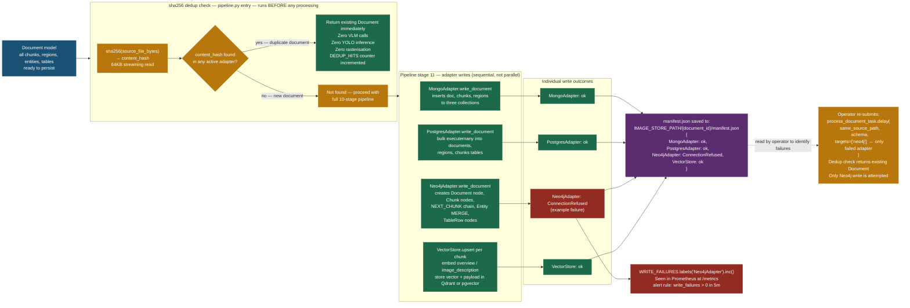

---

## 8. Storage Adapter Internals

**What this shows:** Exactly what each of the four database adapters stores and which features of the data model it exposes for querying.

**When to use which database:**

- **MongoDB**: Best default for most use cases. Flexible schema, text search over `overview`, nested BSON for `table_data`. No SQL needed. Use when your query patterns are document-centric (give me all chunks from this document) or metadata-driven (give me all TABLE chunks with confidence > 0.7).
- **PostgreSQL**: Use when you need SQL joins, JSONB path queries on `structured_data`, or when you want vector search via pgvector without running a separate Qdrant service. The GIN-indexed JSONB columns make it powerful for structured extraction results.
- **Neo4j**: Use when you need cross-document entity queries. "Show me every document that mentions Acme Corp" is a single Cypher traversal. "Show me the financial figures extracted from documents that also mention a particular contract date" requires graph traversal that is cumbersome in SQL and impossible in MongoDB.
- **Vector DB**: Use for semantic similarity search. "Find chunks similar in meaning to this query" regardless of exact keywords. Critical for RAG pipelines where the question and the answer use different vocabulary.

```mermaid
flowchart TD
    classDef chunk  fill:#1A5276,stroke:#1A5276,color:#fff
    classDef mongo  fill:#1D6A4A,stroke:#1D6A4A,color:#fff
    classDef pg     fill:#5B2C6F,stroke:#5B2C6F,color:#fff
    classDef neo    fill:#B7770D,stroke:#B7770D,color:#fff
    classDef vec    fill:#6E2F1A,stroke:#6E2F1A,color:#fff

    CHUNK["DocumentChunk\nall fields populated"]:::chunk

    subgraph mongo ["MongoDB — Motor async — src/storage/mongodb.py"]
        MC1["documents collection\ncontent_hash unique index\ndocument metadata without chunks"]:::mongo
        MC2["chunks collection\noverview field TEXT-indexed ($text search)\nschema_version on every document\n$elemMatch on table_data.cells"]:::mongo
        MC3["regions collection\nraw layout detection output preserved\nqueryCable by region_type and page_number"]:::mongo
        MC4["_adapt_chunk() called on every read\nv1 records upgraded transparently\nNo DB migration required for schema changes"]:::mongo
        MC1 --- MC2 --- MC3 --- MC4
    end

    subgraph pg ["PostgreSQL — asyncpg + pgvector — src/storage/postgres.py"]
        PG1["documents table\ncontent_hash TEXT UNIQUE — dedup index\nmetadata JSONB column"]:::pg
        PG2["chunks table\nstructured_data JSONB + GIN index\ntable_data JSONB + GIN index (partial, WHERE NOT NULL)\nSQL WHERE clause on any column\njsonb_path_exists for nested field queries"]:::pg
        PG3["regions table\nbbox JSONB column\nqueryable by region_type and page_number"]:::pg
        PG4["Optional: chunks.embedding VECTOR(N)\nAdded with ALTER TABLE IF NOT EXISTS\nN from EMBED_DIMENSIONS config\ncosine similarity via <=> operator"]:::pg
        PG1 --- PG2 --- PG3 --- PG4
    end

    subgraph neo4j ["Neo4j — bolt driver async — src/storage/neo4j_store.py"]
        N1["Document node\ncontent_hash UNIQUE constraint\nMERGE prevents duplicate nodes on retry"]:::neo
        N2["Chunk nodes\nNEXT_CHUNK chain built by reading_order_index\ntraversing chain = reading document in order"]:::neo
        N3["Entity nodes\nMERGED by text+type — cross-document dedup\nfirst_seen property = first document to extract it"]:::neo
        N4["TableRow nodes\nHAS_ROW from TABLE Chunk\neach row is a first-class graph object"]:::neo
        N5["Region nodes\nSOURCE_REGION edge from Chunk\npreserves spatial bbox data in graph"]:::neo
        N1 --- N2 --- N3 --- N4 --- N5
    end

    subgraph vec ["Vector DB — src/storage/vector.py (Qdrant or pgvector)"]
        V1{"FIGURE chunk AND\nVISUAL_EMBED_ENABLED=true?"}:::vec
        V2["POST base64 crop image to\nVISUAL_EMBED_ENDPOINT\n(ColPali / ColQwen2)\nCaptures visual structure — chart shape,\ntable density, diagram topology"]:::vec
        V3["POST text to EMBED_ENDPOINT\nFor FIGURE: image_description if non-empty\notherwise overview\nFor all other types: overview text"]:::vec
        V4["Upsert into Qdrant collection or\nPG chunks.embedding column\nPayload: {chunk_id, document_id, content_type,\ncropped_image_path, overview, page_number,\nconfidence_score}\ncropped_image_path in payload = no second lookup needed"]:::vec
        V1 -->|"yes — visual embed"| V2 --> V4
        V1 -->|"no — text embed"| V3 --> V4
    end

    CHUNK --> mongo
    CHUNK --> pg
    CHUNK --> neo4j
    CHUNK --> vec
```

---

## 9. Neo4j Knowledge Graph Structure

**What this shows:** The full node and relationship topology in Neo4j with a concrete example showing two documents sharing an Entity node.

**Why Neo4j for this:** The NEXT_CHUNK chain lets you traverse a document in reading order using pure graph queries. The MENTIONS edges to Entity nodes let you ask "which documents mention company X near financial figure Y?" — a multi-hop question that requires graph traversal. MongoDB and Postgres can answer this with joins and aggregations, but the query is significantly simpler in Cypher and performs better at scale because the graph database stores relationship traversal as first-class O(1) operations rather than O(n) index scans.

**Critical design — Entity MERGE:** When `neo4j_store.py` processes entities from a chunk, it uses `MERGE (e:Entity {text: $text, type: $type})` — not `CREATE`. This means if 500 documents all mention "Acme Corp" as an ORG, there is exactly one `:Entity` node with 500 `MENTIONS` edges pointing to it, not 500 duplicate nodes. This deduplication is what makes the knowledge graph queryable across the corpus rather than just within a single document.

**Critical design — NEXT_CHUNK chain:** The chain is built in `reading_order_index` order. Reading a document in Neo4j is as simple as:
```cypher
MATCH (d:Document {document_id: $id})-[:HAS_CHUNK]->(start:Chunk)
WHERE NOT ()-[:NEXT_CHUNK]->(start)
MATCH path = (start)-[:NEXT_CHUNK*]->(end)
RETURN nodes(path)
```

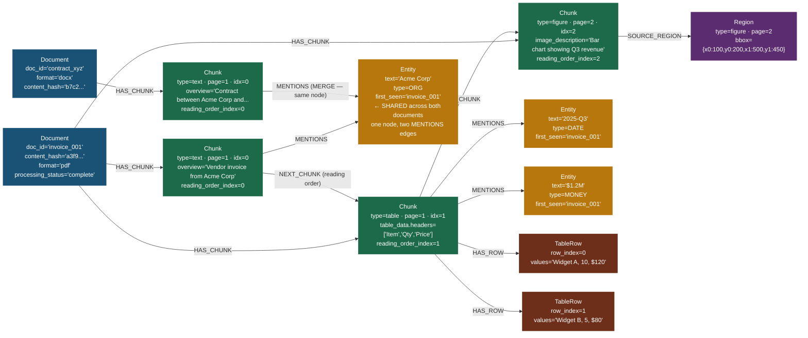

**Example Cypher query — cross-document entity lookup:**
```cypher
MATCH (e:Entity {text: 'Acme Corp', type: 'ORG'})<-[:MENTIONS]-(c:Chunk)<-[:HAS_CHUNK]-(d:Document)
RETURN d.source_path, c.overview, c.page_number, c.confidence_score
ORDER BY d.source_path
```
This returns every chunk in every document that mentions Acme Corp, with the document path and page number — traversing thousands of documents in milliseconds.

---

## 10. Fused Retrieval — Reciprocal Rank Fusion

**What this shows:** How `FusedRetrieval` queries multiple adapters in parallel and merges ranked results into a single ordered list using Reciprocal Rank Fusion.

**Why RRF instead of simple score averaging:** Different adapters return scores on incompatible scales. MongoDB full-text search returns relevance scores in arbitrary units. Qdrant returns cosine similarity (0 to 1). Neo4j traversal returns hop counts (lower is better). You cannot average these. RRF converts every result to a rank position first, then combines ranks using `1 / (k + rank)`. This is parameter-free, scale-invariant, and empirically outperforms linear combination across diverse retrieval systems (Cormack et al. 2009).

**Why k=60:** The RRF constant k=60 is the standard value from the original paper. It controls how steeply rank differences matter — higher k makes the formula more uniform (rank 1 and rank 10 are closer in score). k=60 is robust across most retrieval tasks without tuning.

**Critical — graceful degradation:** If a Neo4j adapter raises an exception (connection refused, slow query timeout), `FusedRetrieval` catches it, logs a warning, excludes that adapter from fusion, and continues with the remaining adapters. The query succeeds with slightly less comprehensive results rather than failing entirely. The `retrieval_sources` metadata field on each result chunk shows which adapters contributed it — useful for debugging.

**Pagination note:** FusedRetrieval does not support cursor-based pagination. It always returns the top `top_k` chunks from a single merged query. For paginated access, use individual adapters directly.

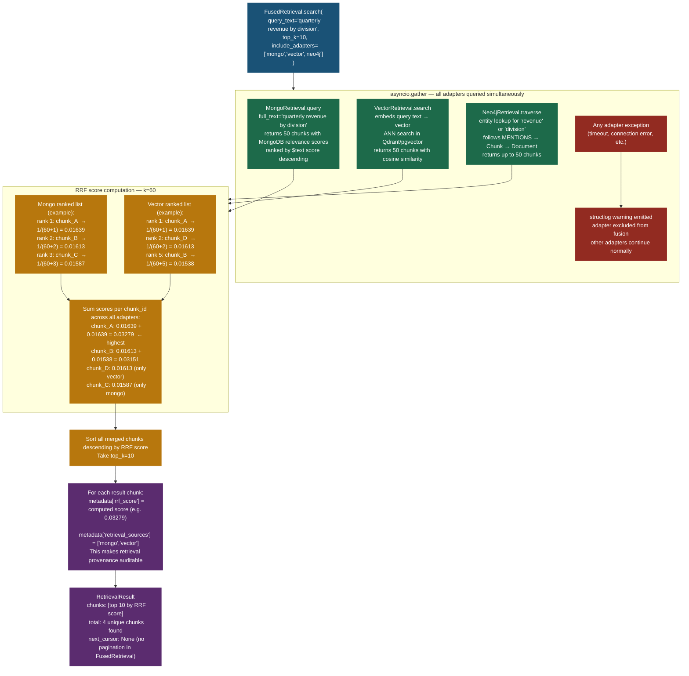

---

## 11. Celery Queue Flow

**What this shows:** The complete lifecycle of a document processing task from initial submission by the caller through Redis, the Celery worker, pipeline execution, and result return.

**Why Celery + Redis instead of synchronous processing:** Without a queue, if a caller submits 100 documents simultaneously, 100 processes would compete for the VLM endpoint's concurrency limit, for database connections, and for YOLO inference slots. With Celery, tasks are serialised through a Redis queue. Worker concurrency is controlled at the worker level (`--concurrency=4` means 4 tasks run simultaneously). Each task then controls its own internal VLM concurrency with `VLM_CONCURRENCY_LIMIT`. This produces predictable throughput.

**Retry behaviour:** If `pipeline.run()` raises any exception, the Celery task retries up to `max_retries=3` times with a 30-second delay between attempts. This handles transient failures (a database restart, a VLM endpoint blip) without requiring manual re-submission. After 3 retries, the task enters the `FAILURE` state and the exception is stored in Redis for inspection.

**Critical — `asyncio.run()` in the task:** Celery tasks are synchronous Python functions. The pipeline is async. `asyncio.run()` creates a new event loop per task, runs the full async pipeline to completion, then returns the `document_id` string. This is the correct pattern for async-in-sync wrapping with Celery.

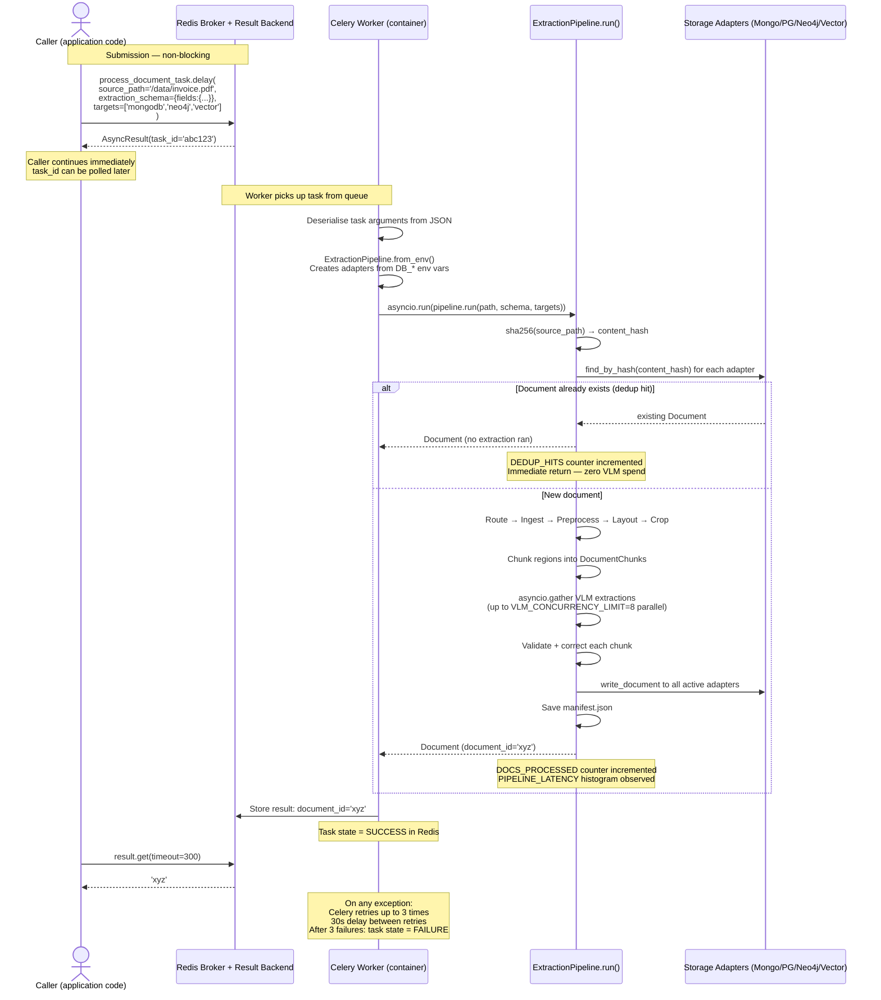

---

## 12. Schema Versioning — Read Adaptation

**What this shows:** How the `_adapt_chunk()` method in `src/storage/base.py` transparently upgrades stored records from older schema versions to the current version on every read, without requiring a full database migration.

**Why schema-on-read instead of schema migration only:** Alembic handles Postgres DDL changes (adding columns). But it cannot rewrite 50 million existing rows. Schema-on-read means: add the new column with a default in Postgres (Alembic), add the v1→v2 upgrade logic in `_adapt_chunk()` for MongoDB and Neo4j (which have no DDL), and increment `CURRENT_SCHEMA_VERSION`. Existing records at v1 are upgraded at the moment they are read — lazily, at zero extra cost.

**v1 → v2 changes (the current upgrade path):**
- `image_path` renamed to `cropped_image_path` (field was renamed for clarity)
- `entities` field added (new NER output — empty list for old records)
- `reading_order_index` added (defaulted to `chunk_index` for backward compatibility)
- `correction_applied` added (False for all old records — they predate the validator)

**Critical — `UnsupportedSchemaVersion` exception:** If a record has a `schema_version` below the minimum supported (i.e. below 1, which would indicate data corruption), `_adapt_chunk()` raises `UnsupportedSchemaVersion`. This bubbles up to the retrieval caller. It is an explicit hard failure rather than silent data corruption — the operator must manually inspect those records.

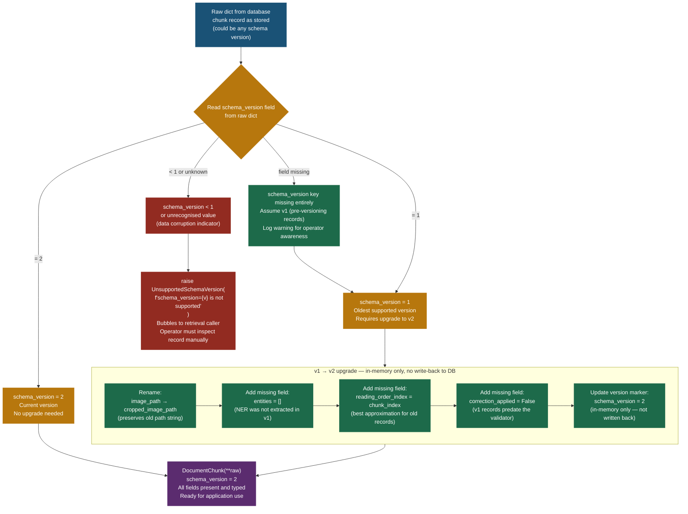

**Adding a new field (future schema v3):**
1. Add field to `DocumentChunk` with a default value in `src/models.py`
2. Increment `CURRENT_SCHEMA_VERSION = 3`
3. Add v2→v3 branch in `_adapt_chunk()`: set new field to default for old records
4. Add Alembic migration for Postgres: `ALTER TABLE chunks ADD COLUMN IF NOT EXISTS new_field TYPE DEFAULT default_val`
5. MongoDB and Neo4j: handled by `_adapt_chunk()` — no schema migration needed

---

## 13. Observability Instrumentation Points

**What this shows:** Exactly where Prometheus metrics, structlog JSON log entries, and OpenTelemetry spans are emitted throughout the pipeline — aligned to the pipeline stages.

**Why three layers:** Metrics (Prometheus) answer aggregated questions over time: "what is my average VLM latency for TABLE regions this week?" Logs (structlog) answer specific questions about individual documents: "why did document abc123 end up in review_required status?" Traces (OTEL) answer latency breakdown questions: "which pipeline stage is the bottleneck for 500-page PDFs?"

**Critical metric — `docintel_correction_passes_total`:** This counter, labelled by `region_type` and `pass_number`, is the primary signal for VLM extraction quality. If `region_type=table, pass_number=1` spikes, the TABLE prompt template needs to be improved. If `pass_number=2` spikes, the correction loop is not effective and manual review is required.

**Critical metric — `docintel_chunk_confidence`:** This histogram shows the distribution of confidence scores across all chunks. A healthy pipeline has > 90% of chunks at confidence 1.0. If the distribution shifts left (many chunks at 0.5 or below), either the VLM endpoint is degraded or a document type is producing consistently poor extractions.

**Log querying example (Loki / CloudWatch):** Every log entry is structured JSON with `document_id` as a field. To trace all log events for a specific document:
```
{app="docintel"} | json | document_id="abc-123-def"
```

```mermaid
flowchart LR
    classDef stage  fill:#1A5276,stroke:#1A5276,color:#fff
    classDef metric fill:#B7770D,stroke:#B7770D,color:#fff
    classDef log    fill:#1D6A4A,stroke:#1D6A4A,color:#fff
    classDef trace  fill:#5B2C6F,stroke:#5B2C6F,color:#fff

    ROUTER["1. Router\nsrc/router.py"]:::stage
    DEDUP["2. Dedup check\npipeline entry"]:::stage
    LAYOUT["3. Layout detection\nper page"]:::stage
    VLM["4. VLM extraction\nper chunk"]:::stage
    VALID["5. Validator\nper chunk"]:::stage
    WRITE["6. Storage writes\nper adapter"]:::stage
    PIPE["7. Pipeline complete"]:::stage

    M1["DEDUP_HITS\n.inc()\nCounter — no labels"]:::metric
    M2["LAYOUT_REGIONS\n.labels(region_type)\n.inc()\nCounter per region type"]:::metric
    M3["VLM_LATENCY\n.labels(region_type)\n.observe(elapsed_s)\nHistogram — buckets 0.5s to 60s"]:::metric
    M4["CONFIDENCE_HIST\n.observe(score)\nHistogram — buckets 0.0 to 1.0"]:::metric
    M5["CORRECTIONS\n.labels(region_type, pass_number)\n.inc()\nCounter — pass_number='1' or '2'"]:::metric
    M6["WRITE_FAILURES\n.labels(adapter_class_name)\n.inc()\nCounter — alert when > 0"]:::metric
    M7["DOCS_PROCESSED\n.labels(status)\n.inc()\nCounter — status='complete' or 'review_required'"]:::metric
    M8["PIPELINE_LATENCY\n.observe(total_seconds)\nHistogram — buckets 5s to 600s"]:::metric

    L1["router_decision\n{format, ingestor, quality_tier, content_hash}"]:::log
    L2["dedup_hit\n{document_id, existing_document_id, hash}"]:::log
    L3["pipeline_stage\n{stage='layout', region_count, page_count}"]:::log
    L4["pipeline_stage\n{stage='extract', chunk_count}"]:::log
    L5["adapter_write_ok / adapter_write_failed\n{adapter, document_id, error_if_failed}"]:::log
    L6["pipeline_complete\n{document_id, status, chunks, elapsed_s}"]:::log

    T1["OTEL span: layout_detection\nattrs: page_count, regions_detected\n→ measures YOLO throughput"]:::trace
    T2["OTEL span: vlm_extraction\nattrs: region_type, chunk_id, correction_pass\n→ measures per-region VLM cost"]:::trace
    T3["OTEL span: storage_write\nattrs: adapter, document_id, chunk_count\n→ measures write throughput per DB"]:::trace

    ROUTER --> L1
    DEDUP --> M1 & L2
    LAYOUT --> M2 & L3 & T1
    VLM --> M3 & L4 & T2
    VALID --> M4 & M5
    WRITE --> M6 & L5 & T3
    PIPE --> M7 & M8 & L6
```

**Prometheus alert rules (recommended):**

| Alert | Condition | Severity |
|---|---|---|
| High correction rate | `rate(docintel_correction_passes_total[5m]) > 5` | Warning |
| Write failures | `docintel_storage_write_failures_total > 0` | Critical |
| Low confidence documents | `histogram_quantile(0.5, docintel_chunk_confidence) < 0.5` | Warning |
| VLM latency spike | `histogram_quantile(0.95, docintel_vlm_latency_seconds) > 30` | Warning |

---

## 14. Page Break Bridging Detail

**What this shows:** The specific logic in `src/extraction/chunker.py` that detects when a sentence spans two pages and sets `page_break_context` on both adjacent chunks.

**Why this is critical for RAG:** In a retrieval-augmented generation pipeline, a query like "what were the contract termination conditions?" may span multiple pages of a contract document. If the relevant sentence is split across pages, a vector search will return only one of the two chunks — the context is incomplete. `page_break_context` encodes both halves of the sentence on each chunk, so either chunk is findable and the reader can reconstruct the full content.

**The heuristic — why punctuation check:** The check `last_char not in {'.', '!', '?'}` is a fast approximation. It catches most mid-sentence page breaks (they are very common in contracts, academic papers, and reports). It will miss cases where a page ends with an abbreviation period (e.g. "Fig. 3") but those are rare and the false negative (no bridging) is harmless — the content is still readable.

**What the context strings contain:** The 50-character snippets from each side of the break are stored in `page_break_context`. They serve two purposes: (1) they allow the reader to visually confirm a break is present, and (2) they improve embedding quality for the affected chunks — the embedding model sees part of the surrounding sentence context, not just the truncated chunk text.

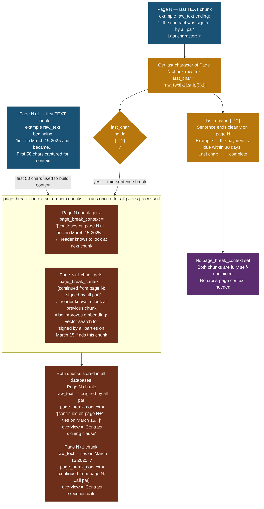

---

## 15. Table Extraction Data Flow

**What this shows:** How `src/extraction/table_parser.py` converts the VLM's raw JSON response for a TABLE region into the typed `TableData` model, handling three different response formats and two special cases (multi-page tables and tables embedded as images).

**Why three response formats:** DeepSeek-OCR-2 is instructed to produce a full structured response (headers + rows + cells) via the TABLE prompt template. However, VLMs are probabilistic — sometimes they omit the structured fields and return only a markdown table string. Sometimes they return only `raw_text`. The parser handles all three cases gracefully, extracting as much structure as possible from whatever the VLM provided.

**Multi-page table merging — why it needs special handling:** Large tables in financial reports, academic papers, and legal documents frequently span multiple pages. DocLayout-YOLO will detect a TABLE region on page N and another on page N+1 — but these are actually one table. The continuation check uses a heuristic: if the last region on page N is TABLE, the first region on page N+1 is TABLE, and the page N+1 region has no rows that look like a header (no bolding detectable, no all-caps row), they are merged into one `DocumentChunk` with `continued_from_page=N` and `merge_confidence=0.9`.

**Table-in-image reclassification:** Enterprise documents often contain screenshots of Excel spreadsheets embedded as figures. DocLayout-YOLO classifies these as FIGURE (it sees an image boundary, not a table border). The VLM, however, will describe the image as containing a table and include markdown table syntax in the response. `reclassify_figure_as_table()` detects this by counting pipe-delimited lines in the response text — if 3 or more are found, the chunk is reclassified as TABLE and fully parsed.

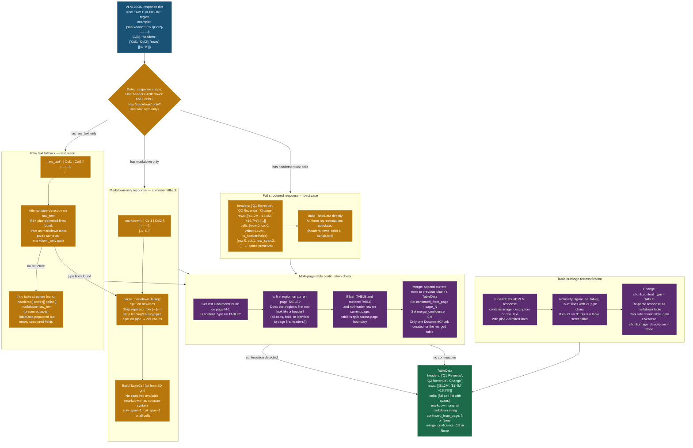

---

## 16. Module Dependency Map

**What this shows:** The complete import dependency graph across all 37 Python modules. Use this to understand the blast radius of any change — modifying a module affects all modules that depend on it.

**Critical modules — high impact on change:**
- `src/models.py` — imported by every single module. Any field change here requires updating `_adapt_chunk()` in `storage/base.py` and incrementing `CURRENT_SCHEMA_VERSION`.
- `src/config.py` — imported by all modules that need configuration. Adding a new config class here is safe (additive). Changing an existing field name requires updating `.env` and `docker-compose.yml`.
- `src/extraction/pipeline.py` — the orchestration hub. It imports from every stage. Changes here affect `src/worker.py` (the entry point) but nothing else depends on pipeline.

**Safe to modify independently (no downstream dependents):**
- Any individual `src/ingestion/*.py` ingestor — only the router imports them
- Any individual `src/storage/*.py` adapter — only retrieval modules depend on them
- Any individual `src/retrieval/*.py` adapter — only `fused.py` and application callers depend on them
- `src/worker.py` — the leaf of the dependency tree

```mermaid
flowchart TD
    classDef foundation fill:#1A5276,stroke:#1A5276,color:#fff
    classDef infra      fill:#1D6A4A,stroke:#1D6A4A,color:#fff
    classDef layout_mod fill:#B7770D,stroke:#B7770D,color:#fff
    classDef extract    fill:#5B2C6F,stroke:#5B2C6F,color:#fff
    classDef storage    fill:#6E2F1A,stroke:#6E2F1A,color:#fff
    classDef retrieve   fill:#154360,stroke:#154360,color:#fff
    classDef entry      fill:#922B21,stroke:#922B21,color:#fff

    models["src/models.py\nHighest-impact module\nImported by every other module\nChange here = update _adapt_chunk + schema version"]:::foundation
    config["src/config.py\nAll Pydantic BaseSettings classes\nLoaded from .env at startup\nChange = update .env template + docker-compose"]:::foundation
    obs["src/observability.py\nMetrics counters + histograms\nstructlog configuration\nOTEL tracer setup"]:::infra

    router["src/router.py\nFormat detection + quality scoring\nOnly entry point that reads file before queuing"]:::infra
    ing_base["src/ingestion/base.py\nAbstract IngestorBase + PageResult dataclass\nAll ingestors inherit from this"]:::infra
    ing_fmt["src/ingestion/\npdf.py · docx.py · image.py\ntext.py · excel.py · email.py\nSafe to modify independently — only router imports"]:::infra

    preproc["src/layout/preprocessor.py\ndeskew + denoise + CLAHE\nAlways runs — no config flag"]:::layout_mod
    detector["src/layout/detector.py\nDocLayout-YOLO model loading\nGraceful fallback if weights missing"]:::layout_mod
    rd_order["src/layout/reading_order.py\nXY-cut algorithm\nCritical for multi-column documents"]:::layout_mod
    cropper["src/layout/cropper.py\nPNG crop + sha256 + file save\nSets cropped_image_path on RawRegion"]:::layout_mod

    vlm["src/extraction/vlm_client.py\nHttpx async client\nLoads YAML prompt templates\nBase64 image encoding"]:::extract
    tp["src/extraction/table_parser.py\nMarkdown → TableData\nMulti-page table merge\nFigure reclassification"]:::extract
    chunker["src/extraction/chunker.py\nRegion grouping\nCaption linking\nPage break bridging"]:::extract
    validator["src/extraction/validator.py\nValidationRule dataclass\n3 built-in rules\nCorrection re-prompt loop"]:::extract
    pipeline["src/extraction/pipeline.py\nMain orchestrator\nDedup check\nAsync VLM task pool\nManifest write"]:::extract

    stor_base["src/storage/base.py\nAbstract StorageAdapter\n_adapt_chunk() schema upgrade\nUnsupportedSchemaVersion exception"]:::storage
    stor_mg["src/storage/mongodb.py\nMotor async client\nThree collections\nText index on overview"]:::storage
    stor_pg["src/storage/postgres.py\nasyncpg pool\nJSONB + GIN indexes\npgvector column"]:::storage
    stor_n4["src/storage/neo4j_store.py\nBolt driver\nDocument/Chunk/Entity/TableRow nodes\nEntity MERGE deduplication"]:::storage
    stor_vec["src/storage/vector.py\nQdrant or pgvector backend\nVisual or text embedding branch\nPayload includes image path"]:::storage

    ret_mg["src/retrieval/mongo_retrieval.py\nKeyset pagination on _id\n$text full-text search"]:::retrieve
    ret_pg["src/retrieval/postgres_retrieval.py\nKeyset on chunk_id UUID\nJSONB path queries"]:::retrieve
    ret_n4["src/retrieval/neo4j_retrieval.py\nEntity traversal\nCypher passthrough\nSKIP/LIMIT pagination"]:::retrieve
    ret_vec["src/retrieval/vector_retrieval.py\nANN search\nHybrid filter + vector\nSimilarity score in metadata"]:::retrieve
    fused["src/retrieval/fused.py\nRRF k=60 fusion\nasyncio.gather fan-out\nrrf_score + retrieval_sources annotations"]:::retrieve

    worker["src/worker.py\nLeaf of dependency tree\nCelery app + task definition\nasynio.run wraps async pipeline"]:::entry

    models --> ing_base
    models --> detector
    models --> rd_order
    models --> cropper
    models --> chunker
    models --> tp
    models --> validator
    models --> pipeline
    models --> stor_base
    models --> ret_mg & ret_pg & ret_n4 & ret_vec & fused

    config --> router
    config --> detector
    config --> vlm
    config --> pipeline
    config --> stor_mg & stor_pg & stor_n4 & stor_vec
    config --> worker

    obs --> pipeline & worker

    router --> ing_fmt
    ing_base --> ing_fmt

    preproc --> pipeline
    detector --> pipeline
    rd_order --> pipeline
    cropper --> pipeline

    vlm --> validator
    vlm --> pipeline
    tp --> pipeline
    chunker --> pipeline
    validator --> pipeline

    stor_base --> stor_mg & stor_pg & stor_n4 & stor_vec
    stor_mg --> ret_mg
    stor_pg --> ret_pg
    stor_n4 --> ret_n4
    stor_vec --> ret_vec

    ret_mg & ret_pg & ret_n4 & ret_vec --> fused

    pipeline --> worker
```

---

## Quick Reference — Critical Numbers

| Parameter | Default | Where set | Impact if changed |
|---|---|---|---|
| YOLO conf_threshold | 0.25 | `LAYOUT_CONF_THRESHOLD` | Lower → more false-positive regions → more VLM calls |
| Deskew clamp | ±5° | hardcoded in preprocessor.py | Increase to ±10° for heavily rotated scans |
| XY-cut gap threshold | 20px | hardcoded in reading_order.py | Decrease if dense layouts miss column splits |
| Text merge max_chars | 1500 | `Chunker(max_text_chars=1500)` | Larger → fewer chunks → cheaper but worse retrieval granularity |
| VLM concurrency | 8 | `VLM_CONCURRENCY_LIMIT` | Match to VLM endpoint's max parallel request capacity |
| Correction passes | 2 | `VLM_CORRECTION_MAX_PASSES` | 3 improves quality but adds 30-60s latency for bad regions |
| Page break snippet | 50 chars | hardcoded in chunker.py | Increase to 100 for better embedding context on breaks |
| RRF constant k | 60 | hardcoded in fused.py | Standard value — do not change without benchmarking |
| Confidence review threshold | 0.5 | hardcoded in pipeline.py | Lower to 0.3 for less aggressive review flagging |
| Redis task timeout | 600s | `QUEUE_TASK_TIME_LIMIT` | Increase for very large documents (>200 pages) |
